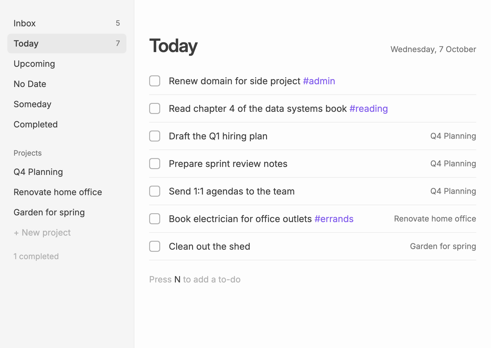
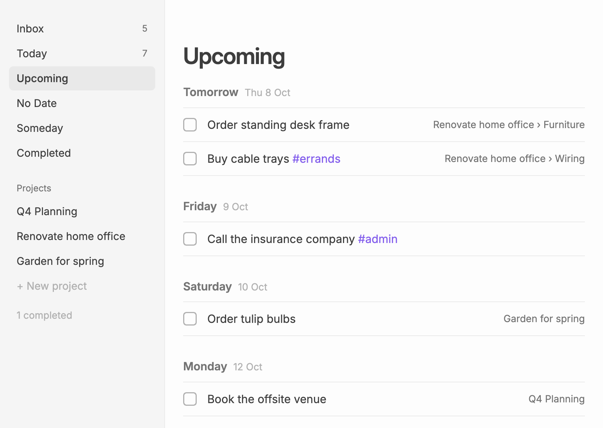
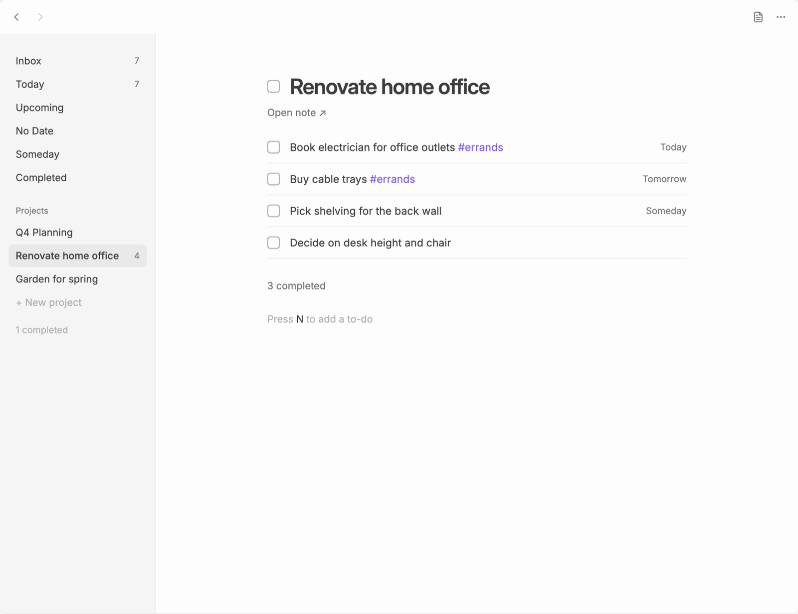
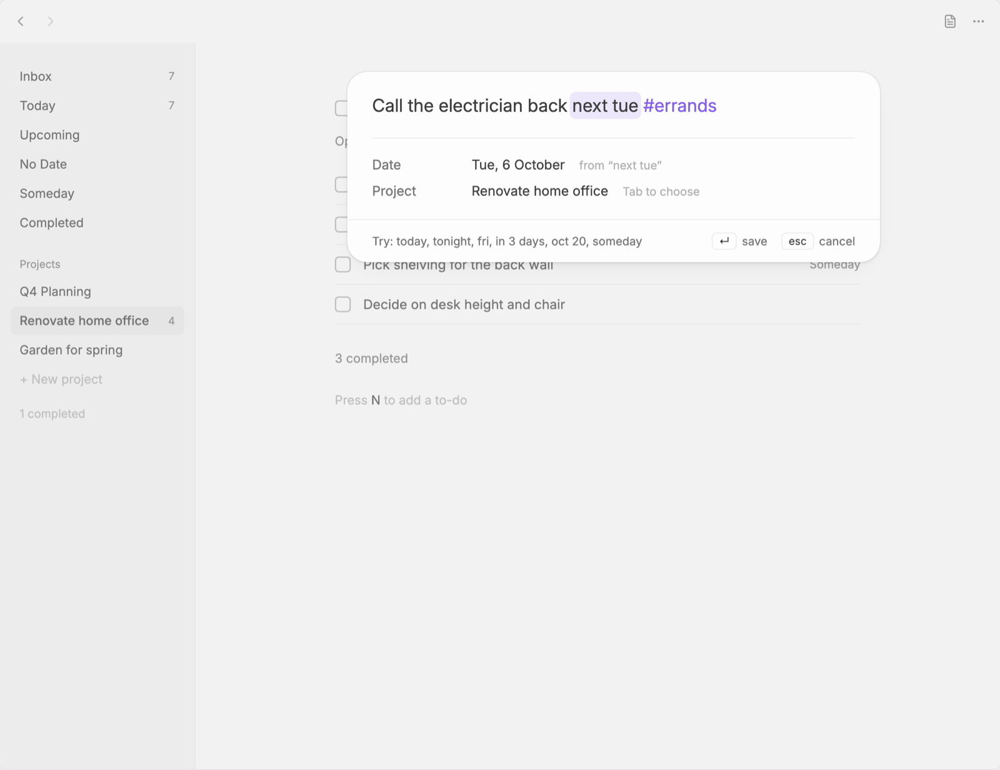

# Plainlist

Plainlist turns your notes into a clean, minimal task manager in Obsidian. A task file holds your Inbox and a list of projects, and each project is an ordinary note: any checkbox in it is a to-do. Everything you do in the view is written back as plain Markdown, and anything you type into the notes by hand shows up in the view straight away.



- **Lists:** Inbox, Today, Upcoming, No Date, Someday and Completed, plus one list per project. Open to-dos from past days move to today.
- **Projects are notes:** create a new project note, or turn an existing note into a project. Its checkboxes, nested ones included, become the project's to-dos.
- **To-dos:** a title, a description, a date and a project. `#tags` and `[[links]]` work in both the title and the description, and typing `[[` suggests notes. Click a to-do to edit it in place; dates and `@project` typed into its title work as in quick capture.
- **Quick capture:** the **New to-do** command opens a small palette that understands dates as you type: "today", "tonight", "fri", "next tue", "in 3 days", "oct 20", "someday". Type `@` to pick a project, e.g. `@House Renovation 2026`.
- **Safe editing:** Plainlist only changes the lines it owns. Headings, notes, tables and callouts it does not understand stay exactly as they are.

| Upcoming | Project |
|---|---|
|  |  |

Quick capture recognises dates as you type and takes them out of the title:



## Installing

In Obsidian, open **Settings → Community plugins → Browse**, search for **Plainlist**, then install and enable it.

To install by hand, download `main.js`, `manifest.json` and `styles.css` from the [latest release](https://github.com/MrVersano/Plainlist/releases/latest) into `<your vault>/.obsidian/plugins/plainlist/`, then enable Plainlist under **Settings → Community plugins**.

Plainlist needs Obsidian 1.13 or later, and works on desktop and mobile.

## Getting started

Run **Plainlist: Open** from the command palette (or click the ribbon icon). It opens `Tasks.md`, creating it if needed. Any note with `plainlist: true` in its properties opens in the Plainlist view; use the header button or **Plainlist: Switch between task list and Markdown** to see the raw Markdown.

Plainlist does not set a hotkey for you. To capture from anywhere in Obsidian, bind **Plainlist: New to-do** under **Settings → Hotkeys**; `Mod+Shift+N` works well.

On desktop you can also capture from any other app. Turn on **System-wide quick entry** in Plainlist's settings, and a global shortcut (`Cmd+Option+N` / `Ctrl+Alt+N` by default) opens the same palette in a small floating window while Obsidian is running. Enter saves and closes it; Escape or clicking elsewhere dismisses it.

## Projects

Click **+ New project** at the bottom of the sidebar and type:

- a new name, then choose **Create “name”** to make a new note (in your **Default location for new notes**), or
- part of an existing note's name, then pick the note to add it as a project. Plainlist only adds a link to the task file; the note itself is not changed until you edit one of its to-dos.

New to-dos for a project go after the last to-do in its note, or above its first heading if it has headings.

Headings in a project note group its to-dos: the project view shows each heading above the to-dos under it, and other lists show the to-do's place as "Project › Heading". The note's title (a single `#` heading at the top) doesn't count. In the project picker and the `@` list, each project lists its headings; pick one to add or move a to-do under it. You can also type `@Project/Heading`.

Renaming a project renames its note. **Remove from Plainlist** (right-click a project) removes the link only: the note and its checkboxes stay as they are.

To finish a project, tick the checkbox next to its title (or right-click it and choose **Complete project**). Any open to-dos in its note are marked done too, after you confirm, and you can undo for a few seconds. Completed projects move under a quiet "N completed" toggle at the bottom of the sidebar and appear in the Completed list; right-click one to reopen it.

## File format

The task file:

```markdown
---
plainlist: true
---

# Inbox
- [ ] Renew domain for side project #admin [date:: 2026-10-04]
- [ ] Look into a new backup drive

# Projects
- [[Renovate home office]]
- [[Q4 Planning]]
- [x] [[Garden for spring]] [done:: 2026-10-03]
```

A project note, `Renovate home office.md`, can contain anything; Plainlist reads its checkboxes:

```markdown
Finish the office before winter.

- [ ] Book electrician for office outlets #errands [date:: 2026-10-04]
	Four more outlets on the desk wall and one by the window.
- [ ] Order standing desk frame [date:: 2026-10-20]
    - [ ] Measure the desk wall
- [x] Order cable trays [done:: 2026-10-02]

## Notes
The electrician is free Thursday mornings.
```

| Element | Syntax |
|---|---|
| Inbox | To-dos under `# Inbox` in the task file |
| Project | A link list item (`- [[Note]]` or `- [Note](Note.md)`) under `# Projects` in the task file |
| Completed project | `- [x] [[Note]] [done:: YYYY-MM-DD]` |
| To-do | Any checkbox, at any indent: `- [ ] title`, `* [x] title`, `1. [ ] title` |
| Description | Indented lines directly under a to-do that are not themselves checkboxes |
| Date | `[date:: YYYY-MM-DD]` or `[date:: someday]` (Dataview inline-field syntax) |
| Completed | `[x]` plus `[done:: YYYY-MM-DD]`, added when you complete a to-do |
| Tags | `#tag` anywhere in a title or description |

To-dos elsewhere in the task file (under another heading, say) show up in the Inbox but are never moved. Checkboxes inside code blocks and callouts are ignored. Unknown inline fields such as `[priority:: high]` stay in the title. Moving a to-do to another project moves the checkboxes nested under it too.

## Keyboard

With the Plainlist view focused:

| Key | Action |
|---|---|
| `↑` `↓` | Move the selection |
| `Enter` | Open or close the selected to-do |
| `Esc` | Close the open to-do |
| `N` | New to-do in the current list |
| `Space` or `Mod+Enter` | Complete or reopen the selected to-do |
| `Mod+Backspace` | Delete the selected to-do (with undo) |

Right-click (or long-press on mobile) a to-do to complete or delete it, or a project to open, rename or remove it.

## Settings

- **Tasks file:** the task file the **Open** command uses. Default: `Tasks.md`.
- **Open this file in Plainlist view by default:** notes with `plainlist: true` open as a task list. Default: on.
- **Week starts on:** used for "next week". Default: your locale.

## Development

```bash
npm install
npm run setup-vault   # installs the Hot Reload plugin into test-vault/
npm run dev           # builds into test-vault/.obsidian/plugins/plainlist and rebuilds on change
npm test              # vitest
npm run lint
npm run build         # type-check and production build (main.js, styles.css)
```

Open `test-vault/` as a vault in Obsidian, turn off Restricted mode, and enable Plainlist and Hot Reload under **Settings → Community plugins**. To build into another vault, set `PLAINLIST_VAULT=/path/to/vault` before `npm run dev`.

The file model (`src/model/`) and date parsing (`src/dates/`) have no Obsidian imports and are covered by the tests in `tests/`.

## Releasing

1. `npm version patch` (or `minor` / `major`) updates `manifest.json`, `package.json` and `versions.json`.
2. Push the commit and tag (`git push --follow-tags`). The release workflow builds the plugin and publishes a GitHub release with `main.js`, `manifest.json` and `styles.css`.
