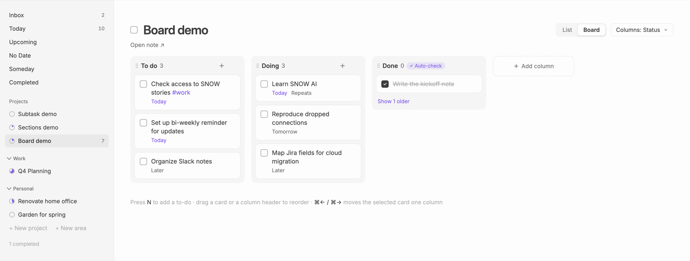

# Board

A project can show its to-dos as a board, with columns such as **To do**, **Doing** and **Done**, instead of as a list. The board is another way to view the same note: moving a card edits the to-do's line, and nothing is kept anywhere else.

Click **Board** at the right of a project's title; **List** switches back. Each project remembers its choice. On a phone, projects always show as a list.

## Columns

The **Columns** menu next to the switch chooses what the columns are:

- **Status** (the default): columns you name yourself. A to-do's column is a `[col:: Doing]` field at the end of its line. A to-do without one is in the first column, or in Done when it's completed.
- **Heading**: one column per heading in the note, plus one for to-dos above the first heading. Moving a card moves its to-do under that heading.

Each column shows how many open to-dos it has. Completed to-dos from the last 7 days show in their column; older ones are behind **Show N older** at the bottom.

## Cards

A card shows the to-do's title and, below it, its date (in the accent colour for today), its heading when the columns are statuses, and **Repeats** for a [repeating to-do](todos.md#repeating-to-dos). Sub-tasks don't get cards of their own: they move with their to-do.

- Click a card's title to open it in place, as in a list.
- Click its checkbox to complete it.
- Right-click a card, or hold it on a touch screen, for **Complete**, **Open**, **Schedule…**, **Move to** the next or previous column, and **Delete**.

## Moving cards

Drag a card to another column, or up and down in its column; on a touch screen, hold it first. The card tilts as you lift it, and a line shows where it will land.

With the keyboard, select a card and press `⌘→` or `⌘←` (`Ctrl` on Windows and Linux) to move it one column. You can also set your own keys for **Plainlist: Move task to next column** and **Move task to previous column** under **Settings → Hotkeys**. In a list, these commands change the selected to-do's column; its row shows the column's name.

When the columns are statuses, a card keeps its place under its heading in the note: only its field changes, and the field is removed when it goes back to the first column.

## Done and auto-check

A column can check and uncheck to-dos. Its **Auto-check** badge says so. The default Done column does all three:

- **Check tasks when moved here**: moving a card into the column completes it, as clicking its checkbox does. A repeating to-do gets its next one, which starts in the first column.
- **Uncheck tasks when moved out**: moving a card out to a column that doesn't check reopens it.
- **Checking a task elsewhere moves it here**: completing a to-do anywhere, in a list, on the board or by ticking it in the note, moves it to this column. Reopening a to-do that's in a column that checks moves it to the first column.

These rules apply to a project once you have switched it to Board, whichever view it shows. Other projects' notes never get `[col:: …]` fields.

## Changing columns

Click **•••** in a column's header (it shows when you point at the header) to rename it, turn its auto-check options on or off, move it left or right, or delete it. Drag a column's header to move it. **Add column**, after the last column, adds one.

- Renaming a column rewrites the field on all its to-dos at once.
- Deleting a column moves its to-dos to the first column. A board keeps at least one column.
- Typing `[col:: Waiting]` on a to-do by hand adds a **Waiting** column, before Done. Turn this off with **Auto-create columns from tasks** in [settings](settings.md#board).

When the columns are headings, these act on the headings: renaming one renames the heading, moving one moves its section in the note, and deleting one removes the heading line, so its to-dos join the section above. **+** in a column's header adds a to-do to it.

New projects start with the **Default columns** from [settings](settings.md#board).

## Keyboard

| Key | Action |
|---|---|
| `←` `→` `↑` `↓` | Move the selection between cards |
| `⌘←` / `⌘→` | Move the selected card one column |
| `Enter` | Open the selected card |
| `Space` or `Mod+Enter` | Complete or reopen it |
| `Delete` / `Backspace` | Delete it (with undo) |
| `N` | New to-do in the selected column |
| `Mod+Z` | Undo |
