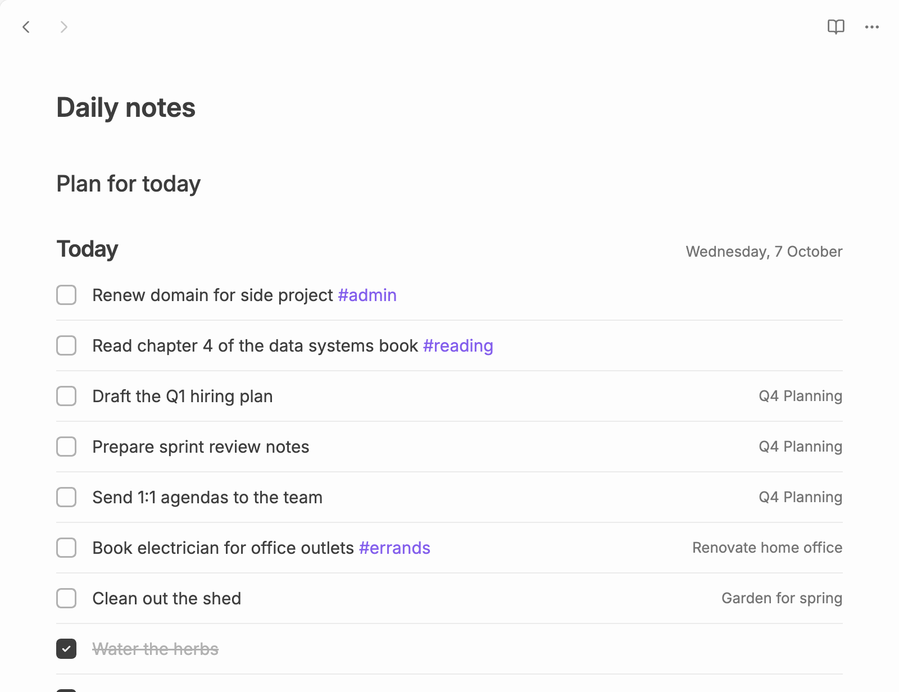

# Lists in notes

Add a `plainlist` code block to any note to show a list there:

````markdown
```plainlist
Today
```
````



It shows Today's to-dos, and you can tick, edit, drag (the same order as the Today list) and right-click them as in the view. Completed to-dos stay in the list too, crossed off, below the open ones, so it also shows what you've done today. One you've just ticked stays in its place for a few seconds before it moves down.

Click **New to-do** under the list to add one for that day.

With **Group Today by project** on in [Settings](settings.md), the list shows a heading for each project, as the Today list does; completed to-dos go to the bottom of their project's group.

The block reads the task file set under [Settings](settings.md).

## Using the keyboard

Click a row: its empty space selects it, and its title opens it for editing (press `Esc` to close it and keep it selected). The list then takes the view's keys (see [Keyboard shortcuts](keyboard.md)), and `Esc` puts the cursor back in the note, below the block.

## Daily notes

In a daily note, write `Note Title` instead of `Today` to show the day the note is named after:

````markdown
```plainlist
Note Title
```
````

Plainlist reads the note's name with the date format from the core **Daily notes** settings (or as `YYYY-MM-DD`), so the block can go in your daily note template:

- **Today's note** shows the same as `Today`.
- **An earlier day's note** shows the to-dos completed that day. Open to-dos from that day aren't shown: they [moved on](lists.md#today) to the next day at midnight. This makes old daily notes a log of what you got done.
- **A later day's note** shows the to-dos dated that day. **New to-do** dates new ones for that day.
