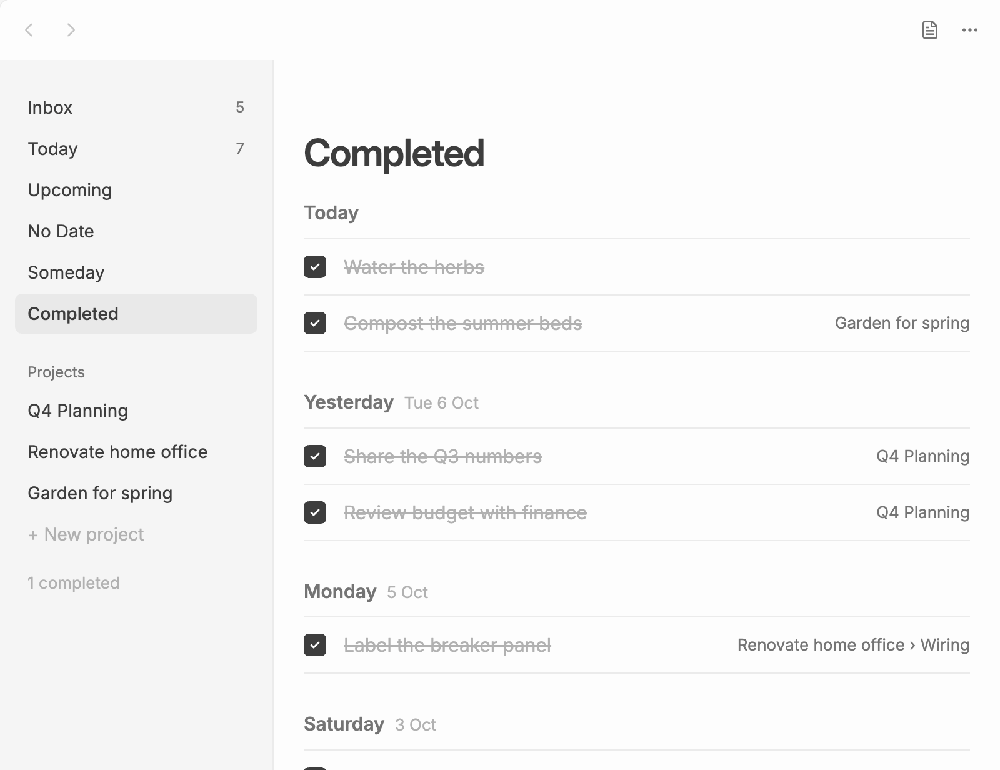

# Lists

The sidebar has six lists, plus one list per [project](projects.md). Every to-do shows up in the lists that match its date and project. You don't file it anywhere by hand.

| List | Shows |
|---|---|
| **Inbox** | Open to-dos in the task file itself, not in a project, except those marked "someday" |
| **Today** | Open to-dos dated today or earlier |
| **Upcoming** | Open to-dos dated after today, grouped by day |
| **No Date** | Open project to-dos with no date |
| **Someday** | Open to-dos marked "someday" |
| **Completed** | Done to-dos and completed projects, newest first |

Inbox and Today show a count in the sidebar.

## Today

Today has everything due today. Each to-do shows its project on the right.

**Rollover:** open to-dos from past days move to today. At midnight, or when you open Plainlist, an open to-do dated before today has its date changed to today in its note. Nothing gets left behind on a day you've already passed. A [repeating to-do](todos.md#repeating-to-dos) rolls over too; a rule tied to a day, such as `every mon`, still comes back on that day.

**Your order:** drag to-dos in Today into any order. Plainlist remembers it in its own data, not in your notes, so it doesn't move lines around in your project notes. See [Reordering](todos.md#reordering).

**Group by project:** turn on **Group Today by project** in [Settings](settings.md) to show Today's to-dos under a heading for each project, with Inbox to-dos first and projects in sidebar order. A to-do then shows only its heading on the right, and you can drag it only within its project. Lists in notes are grouped the same way.

## Upcoming

Upcoming lists future to-dos by day: **Tomorrow**, then each weekday for the next week, then "Later in October", "November" and so on. A to-do under a heading in its project note shows where it lives, as **Project › Heading**.

The **Week starts on** [setting](settings.md) decides what "next week" means.

## No Date and Someday

**No Date** collects project to-dos that have no date, grouped by project. It's useful for finding work you haven't scheduled yet. Inbox to-dos without a date stay in the Inbox.

**Someday** collects to-dos marked `someday`: ideas and maybes you don't want to see every day. Type "someday" in [quick capture](quick-capture.md), or pick **Someday** in a to-do's date picker. A to-do marked someday that isn't in a project leaves the Inbox and shows here only, under Inbox.

## Completed

When you complete a to-do, it stays in its list, crossed off, for a few seconds before it fades away. After that it lives in **Completed**, grouped by the day you completed it (**Today**, **Yesterday**, the weekday, then "Earlier in October" and so on), and in its project's "N completed" section.

[Completed projects](projects.md#completing-a-project) appear here too, on the day you finished them.

## Resizing and hiding the sidebar

Drag the sidebar's right edge to make it wider or narrower. Drag it all the way to the left to hide it. To bring it back, drag or click the view's left edge.
