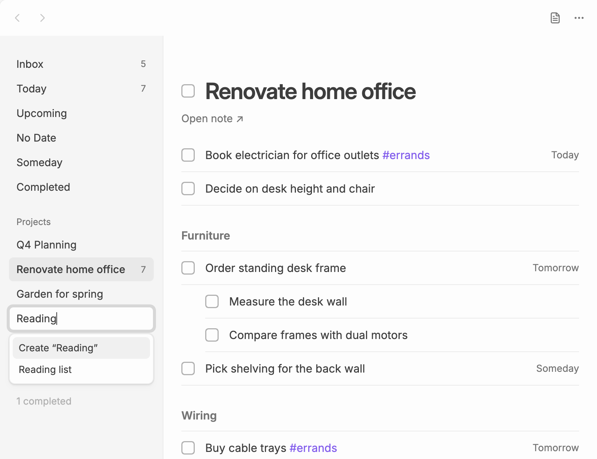
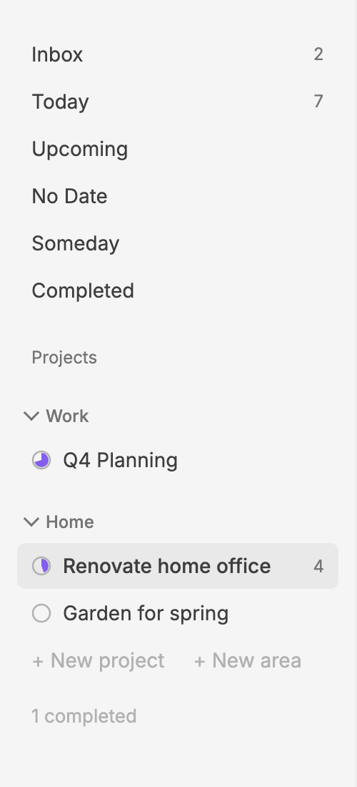

# Projects

A project is an ordinary note. Every checkbox in it, nested ones included, is one of the project's to-dos. The task file keeps a list of links to your project notes under `# Projects`; see the [file format](file-format.md).

Click **Open note ↗** under the title to open the note itself.

In the sidebar, a small ring before each project's name fills up as its to-dos get done. A completed project's ring is full.

## Adding a project

Click **+ New project** at the bottom of the sidebar and type:

- a new name, then choose **Create “name”** to make a new note (in your **Default location for new notes**), or
- part of an existing note's name, then pick the note to add it as a project. Plainlist only adds a link to the task file. The note itself is not changed until you edit one of its to-dos.

New to-dos for a project go after the last to-do in its note, or above its first heading if it has headings.

A new project goes at the end of the projects that aren't in an [area](#areas).

## Adding projects by tag

To make tagged notes projects, enter their tags in **Settings → Plainlist → Project tags**, for example `#project, #client`. As you type, Plainlist suggests tags from your vault, with the number of notes using each. Then:

- When you close settings, every note that already has a newly entered tag is added.
- A note is added as soon as it gets one of the tags, in its text or its `tags` property.
- Nested tags count: `#project/home` matches `#project`. Case doesn't matter.

Notes that are already projects, open or completed, aren't added twice. If you remove a tagged project from Plainlist, it stays removed until its note loses the tag and gets it again.

Removing a tag from the setting, or clearing it, never removes projects on its own. When you close settings, Plainlist lists the open projects whose notes have a removed tag and none of the remaining ones, and asks whether to remove them. **Keep** leaves them as they are; **Remove** takes them out of Plainlist, as **Remove from Plainlist** does. Completed projects are never offered.

## Headings

Headings in a project note group its to-dos. The project view shows each heading above the to-dos under it, and other lists show the to-do's place as **Project › Heading**. The note's title (a single `#` heading at the top) doesn't count.

Every heading shows as a section, even one with no open to-dos yet.

In the project picker and the `@` list in [quick capture](quick-capture.md#picking-a-project), each project lists its headings. Pick one to add or move a to-do under it. You can also type `@Project/Heading`.

### Adding and arranging sections

- Click **+ New section** below a project's to-dos and type its name. Plainlist adds a heading at the end of the note, at the level of its other sections (`##` if it has none). On a phone you can also tap **•••** at the top, then **New section**.
- To change the order of sections, drag a section's name above or below another's; on a touch screen, hold the name first, then drag. Every section folds while you drag, so you can see where it will land. A section moves with everything under it in the note, including deeper headings. It can only move among the sections at its level inside the same section.
- Drag a to-do onto a section's name to move it to the end of that section.
- Right-click a section's name, hold it on a touch screen, or click **•••** next to it for **Add to-do**, **Rename**, **Move up** and **Move down**.

Section names in a note must differ from each other.

## Areas

Areas group projects in the sidebar, for example **Work** and **Home**. Projects that aren't in an area come first, then each area with its projects under it.

- Click **+ New area** at the bottom of the sidebar and type its name.
- To put a project in an area, drag it onto the area's name, or among the area's projects. Or right-click it and choose **Move to area…**, which also offers **No area**.
- Click an area's name to fold it away, and again to unfold it. A folded area shows how many open to-dos its projects have. Plainlist remembers which areas are folded on each device.
- To change the order of areas, drag an area's name above or below another area's name; on a touch screen, hold the name first, then drag. Every area folds while you drag, so you can see where it will land. Or right-click an area and choose **Move up** or **Move down**. An area moves with all its projects.
- Right-click an area to **Rename** it or **Remove area**. Removing an area, after you confirm, removes only its name: its projects stay in Plainlist and join the list above it.
- On a phone, or in a narrow pane, tap the list's name at the top to see your areas with their projects under them. Choose **New area** there to add one, or tap an area's name to **Rename** it, **Move up**, **Move down** or **Remove area**. To move a project into an area, open the project and tap **•••**, then **Move to area…**.

In the task file, an area is a heading under `# Projects`, with its projects' links below it; see the [file format](file-format.md#the-task-file). A heading there with to-dos under it, rather than links, is not an area.

## Renaming, reordering and removing

Right-click a project in the sidebar to **Open note**, **Rename**, **Move to area…** (once you have areas) or **Remove from Plainlist**.

- **Rename** renames the note, and Obsidian updates links to it as usual. You can also click the project's title in its view to rename it.
- **Remove from Plainlist** removes the link from the task file only. The note and its checkboxes stay as they are.
- Drag projects in the sidebar to change their order, within an area or into another one.

## Completing a project

To finish a project, tick the checkbox next to its title, or right-click it and choose **Complete project**. Any open to-dos in its note are marked done too, after you confirm, and you can undo for a few seconds.

Completed projects move under a quiet "N completed" toggle at the bottom of the sidebar and appear in the [Completed](lists.md#completed) list. Right-click one and choose **Reopen project** to bring it back.
