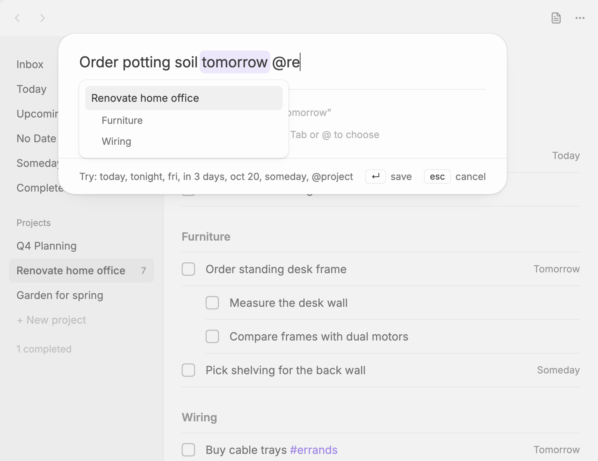

# Quick capture

The **Plainlist: New to-do** command opens a small palette for adding a to-do from anywhere in Obsidian. It understands dates and projects as you type. Bind it to a hotkey under **Settings → Hotkeys**; `Mod+Shift+N` works well.

Type the to-do, then press `Enter` to save or `Esc` to cancel. Inside the Plainlist view, `N` opens the same palette for the list you're on.

## Dates

Type a date anywhere in the title. Plainlist highlights it, shows the date it read, and takes the phrase out of the title when you save. "Call the electrician back next tue" becomes "Call the electrician back", dated next Tuesday.

| You type | Date |
|---|---|
| `today`, `tod`, `tonight` | Today |
| `tomorrow`, `tmr`, `tmrw` | Tomorrow |
| `fri`, `friday` | The coming Friday |
| `next tue` | The next Tuesday after today |
| `next week` | The first day of next week |
| `this weekend` | The coming Saturday |
| `in 3 days`, `in 2 weeks` | That many days or weeks from today |
| `oct 20`, `20 october`, `2026-10-20` | That date |
| `someday` | The [Someday](lists.md#no-date-and-someday) list |

Text inside `[[links]]`, `` `code` ``, URLs and `#tags` is never read as a date. If a title has more than one date phrase, the last one wins.

The first day of the week comes from the **Week starts on** [setting](settings.md).

## Picking a project

Type `@` to pick a project, e.g. `@House Renovation 2026`. A list appears as you type, with each project's headings under it:

Pick a heading to put the to-do under that heading in the project's note, or type `@Project/Heading`. You can also press `Tab` to choose a project from a list.

Without a project, the to-do goes to the Inbox. When you open the palette from a project's view, that project is already filled in.

## The same parsing elsewhere

Dates and `@project` also work when you edit a to-do's title in the view (see [Editing a to-do](todos.md#editing-a-to-do)).

## System-wide quick entry

On desktop you can capture from any app, not only from Obsidian. Turn on **System-wide quick entry** in Plainlist's [settings](settings.md). A global shortcut (`Cmd+Option+N` on macOS, `Ctrl+Alt+N` elsewhere, by default) then opens the same palette in a small floating window while Obsidian is running.

- `Enter` saves and closes it.
- `Esc` or clicking elsewhere dismisses it.

To change the shortcut, click it under **Global shortcut** and press a new combination. It needs at least one of `Ctrl`, `Alt` or `⌘`.

To capture from other apps on mobile, or from automation tools, use an [`obsidian://plainlist-add` link](adding-from-other-apps.md).
