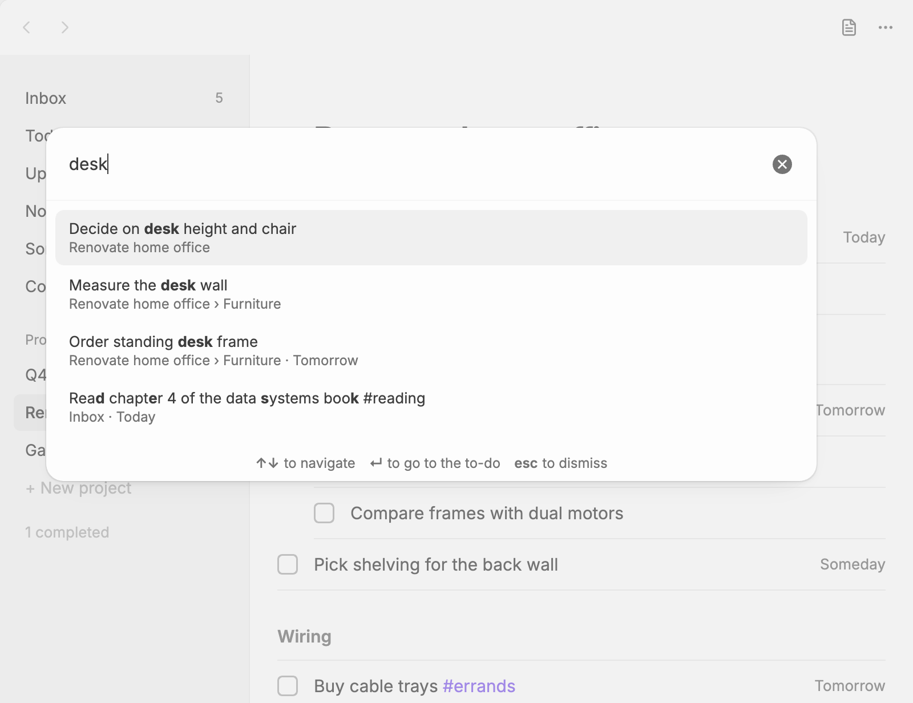

# Search and navigation

## Searching to-dos

The **Plainlist: Search to-dos** command fuzzy-finds any to-do by its title or project, from anywhere in Obsidian.

Titles read as they do in the list, with `[[links]]` shown by their name or alias, without brackets. Each result shows where the to-do lives (its project and heading, or Inbox) and its date. Pick one to jump to it: Plainlist opens a list that has it, scrolls to it and highlights it.

Completed to-dos are left out unless you turn on **Search completed to-dos** in the [settings](settings.md).

## Going to a list

These commands open Plainlist on a list, from anywhere in Obsidian:

- **Plainlist: Go to Inbox**
- **Plainlist: Go to Today**
- **Plainlist: Go to Upcoming**
- **Plainlist: Go to No Date**
- **Plainlist: Go to Someday**

Bind them to hotkeys under **Settings → Hotkeys** to switch lists with one key press.

## Other commands

| Command | What it does |
|---|---|
| **Plainlist: Open** | Opens your task file in the Plainlist view, creating it if needed |
| **Plainlist: New to-do** | Opens [quick capture](quick-capture.md) |
| **Plainlist: Move selected to-dos to a project** | Picks a project, heading or the Inbox for the [selected to-dos](todos.md#working-on-several-to-dos-at-once), or the highlighted one |
| **Plainlist: Schedule selected to-dos** | Picks a date for the selected to-dos, or the highlighted one |
| **Plainlist: Switch between task list and Markdown** | Shows the current task file as raw Markdown, or back as a task list |
| **Plainlist: Undo** | [Undoes](todos.md#undo) the last change made in the Plainlist view, as `Mod+Z` does there |

For moving around inside the view, see [Keyboard shortcuts](keyboard.md).
