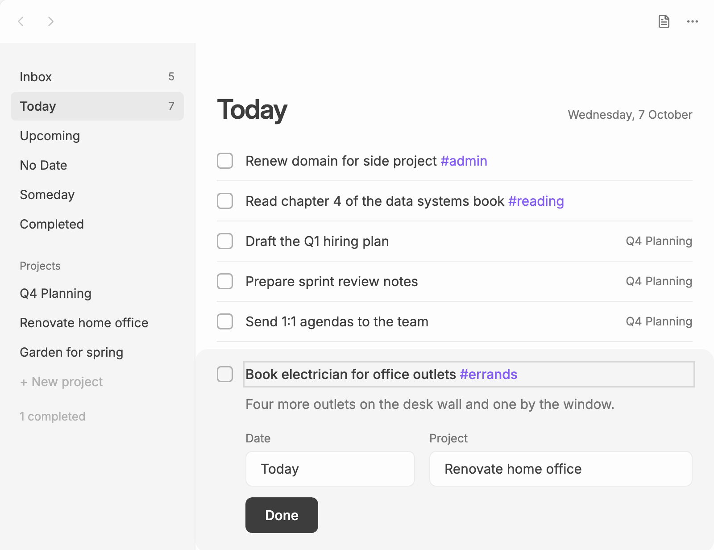
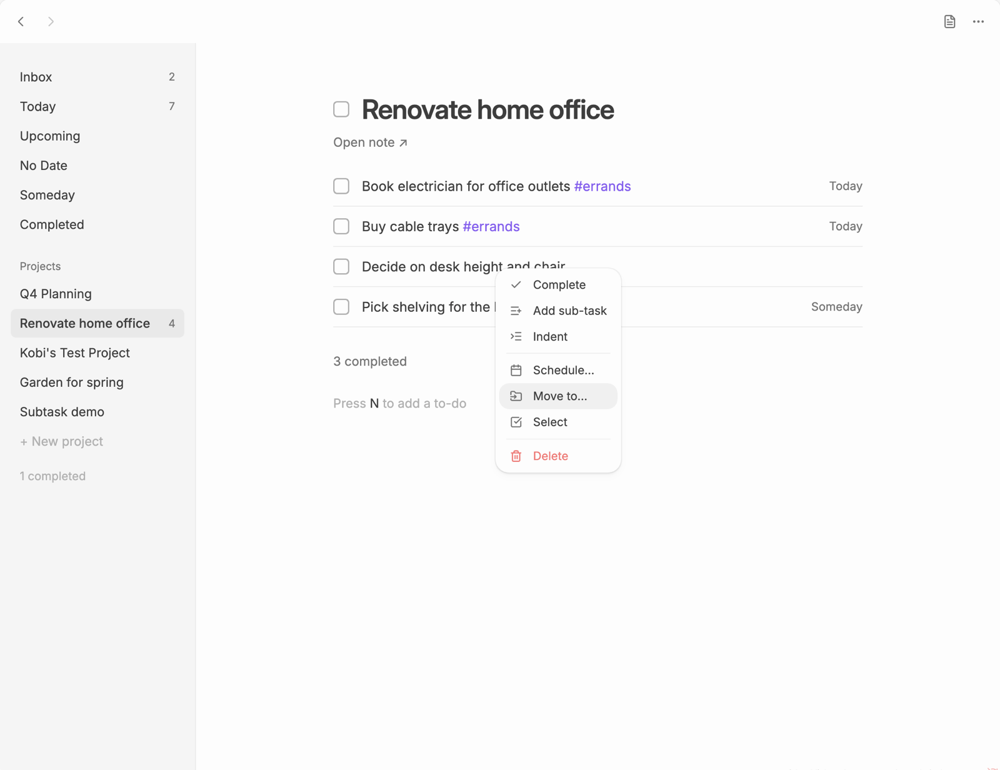

# To-dos

A to-do has a title, an optional description, a date and a project, and it can [repeat](#repeating-to-dos). Every one of them is an ordinary Markdown checkbox in a note, so you can edit it in the Plainlist view or in the note itself. See the [file format](file-format.md) for what that looks like.

## Editing a to-do

Click a to-do's title to open it in place:



- **Title:** edit it directly. Dates, repeat rules and `@project` typed into the title work as in [quick capture](quick-capture.md): "Call Sam fri" moves the to-do to Friday and takes "fri" out of the title.
- **Description:** the notes under the title. They're stored as indented lines under the checkbox.
- **Date:** type a date ("fri", "next week", "oct 20", "someday") or pick **Today**, **Tomorrow**, **Someday** or **Clear**.
- **Repeat:** pick **Daily**, **Weekdays**, **Weekly**, **Monthly**, **Yearly** or **Never**, or type a rule such as "every 2 weeks" or "every last sunday". Tick **Repeat from the day it's completed** to make it [repeat when done](#repeat-when-done).
- **Project:** move the to-do to another project or to the Inbox, or under a heading in a project note.

Press **Done** or `Esc`, or `Enter` in the title, to close it.

### Tags and links

`#tags` and `[[links]]` work in both the title and the description. Typing `[[` suggests notes, as in the Obsidian editor. Click a link to open the note.

## Completing a to-do

Click the checkbox, or select the to-do and press `Space`. A completed to-do stays in its list, crossed off, for a few seconds, then moves to [Completed](lists.md#completed). Plainlist writes `[x]` and a `[done:: YYYY-MM-DD]` date to the line.

To reopen one, find it in Completed (or in its project's "N completed" section) and click its checkbox again.

## Repeating to-dos

A repeating to-do comes back after you complete it. Give it a rule in the editor's **Repeat** field, or type one into the title, e.g. "Water plants every 3 days".

When you complete it, Plainlist ticks it as usual and adds a fresh copy just above it, dated for the next time. A toast shows that date, with **Undo**. The completed one stays in your note as a record, so it shows in [Completed](lists.md#completed) like any other. Sub-tasks and the description come along to the new copy, open again. Any sub-tasks still open on the completed one are ticked with it.

This also works when you tick the checkbox in the note itself. Plainlist adds the next one straight away.

Repeating to-dos show a repeat icon in the lists.

### Rules

| Rule | Repeats |
|---|---|
| `every day`, `every 3 days` | Every day, or every few days |
| `every weekday` | Monday to Friday |
| `every week`, `every 2 weeks`, `every other week` | Every week, or every few weeks |
| `every mon`, `every mon, thu`, `every other fri` | On those days of the week |
| `every 2 weeks on tue` | On that day, every few weeks |
| `every month`, `every 3 months` | Every month, or every few months, on the same day |
| `every month on the 15th`, `every month on the last day` | On that day of the month |
| `every 2nd monday`, `every last sunday` | On that weekday of the month: `1st` to `5th`, `first` to `fifth`, or `last` |
| `every 3 months on the 2nd tue` | On that weekday of the month, every few months |
| `every year` | Every year, on the same date |

Months without a 5th weekday are skipped. A day such as the 31st falls on the last day of shorter months.

The next date counts from the to-do's date. If you complete it late, any dates that have already passed are skipped, so the next one isn't overdue straight away. A to-do with a rule but no date gets the rule's first date from today.

### Repeat when done

Add `when done` to a rule, e.g. `every month when done`, to count from the day you complete the to-do instead of from its date. "Check engine oil every month when done", ticked on 20 October, comes back on 20 November, whether you were early or late.

For a rule tied to a day, such as `every last sunday when done`, the next one is the first matching day after the day you complete it.

## Sub-tasks

A checkbox indented under another checkbox is its sub-task. It shows indented under its parent in every list.

- Press `Tab` to make the selected to-do a sub-task of the one above it, and `Shift+Tab` to move it out of its parent.
- Or right-click a to-do and choose **Add sub-task**.

Moving or deleting a parent takes its sub-tasks with it.

## The right-click menu

Right-click a to-do (or long-press it without moving, on mobile) for its menu:



It offers whichever of these fit the to-do and the list you're on: **Complete** (or **Mark as open**), **Add sub-task**, **Indent**, **Outdent**, **Schedule…**, **Move to…**, **Select** and **Delete**. With several to-dos [selected](#working-on-several-to-dos-at-once), right-clicking one of them acts on them all. Deleting shows a toast with **Undo** for a few seconds.

## Working on several to-dos at once

Select several to-dos to complete, schedule, move or delete them together:

- `Mod`-click a to-do to add it to the selection, or to take it out again.
- `Shift`-click to select every to-do from the last one you picked to this one. With the keyboard, `Shift+↑` / `Shift+↓` does the same.
- `Mod+A` selects every to-do in the list.
- On mobile, long-press a to-do and choose **Select**. Tapping other to-dos then adds them to the selection, or takes them out.

A bar at the bottom of the list shows how many are selected, with **Complete** (or **Mark as open**, when they're all done), **Schedule**, **Move** and **Delete**. **Schedule** offers the same choices as a to-do's date field. **Move** sends them to the Inbox, a project, or a heading in a project note, in the order they were in. The keys work too: `Space` completes them all and `Backspace` deletes them all. Right-click one of them for the same actions.

Completing, scheduling and deleting show a toast with **Undo**. Moving or deleting a selected to-do takes its sub-tasks with it, as it does for one to-do. Press `Esc`, an arrow key or the bar's **×** to clear the selection.

The **Plainlist: Move selected to-dos to a project** and **Plainlist: Schedule selected to-dos** commands open the same pickers, so you can give them hotkeys. With nothing selected, they act on the highlighted to-do.

Selecting several to-dos works in the Plainlist view, not in [lists inside notes](lists-in-notes.md).

## Reordering

Drag a to-do to a new place. On touch screens, hold it, then drag. With the keyboard, select it and press `Alt+↑` / `Alt+↓`.

- **In Today,** put to-dos in any order. Plainlist remembers it in its own data, not in your notes.
- **Everywhere else,** the to-do's lines move in its note. So it moves among the to-dos of its own note, next to others with the same parent.

Drag projects in the sidebar to reorder them.

## Pasting a list

Paste a list into Plainlist and each line becomes a to-do in the list you're on. Each line can be any of:

```markdown
- [ ] Book the venue
- [] Send invites
- Order the cake
[ ] Pick a playlist
```

Indented lines become sub-tasks of the line above. `[date:: …]` fields in the pasted text are kept. If any line isn't a list item or a checkbox, Plainlist leaves the paste alone.

## Safe editing

Plainlist only changes the lines it owns. Headings, notes, tables and callouts it does not understand stay exactly as they are. Anything you type into a note by hand shows up in the view straight away.
